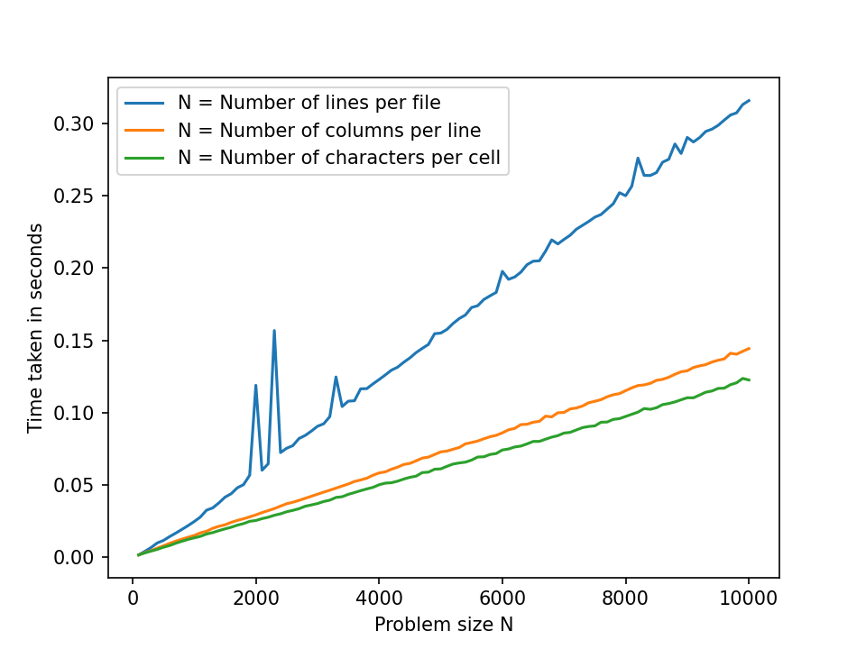

This benchmark uses

```python
row_min, row_max, row_step = 100, 10001, 100
col_min, col_max, col_step = 100, 10001, 100
chr_min, chr_max, chr_step = 100, 10001, 100
```

and a split length of `1000`. Further, hyperfine was set to use 100 warmup and at least 1000 actual runs.

Here are the results:


You can see that there are clear linear correlations between the running time and the numbers of lines, columns and characters. You can also see though, that there are some significant statistical outliers, which are mostly present for specific numbers of lines.